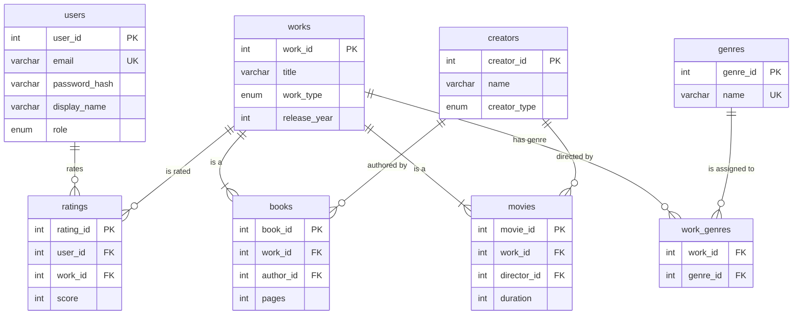

# Postcredits: A Personalized Media Recommendation Engine

## A Major Project Report Submitted in Partial Fulfillment of the Requirements for the Degree of Bachelor of Engineering in Computer Science

### Course: UCS310 - Database Management Systems

**Submitted By:**

| Name               | Roll Number        |
| ------------------ | ------------------ |
| `[Your Name]`      | `[Your Roll]`      |
| `[Partner's Name]` | `[Partner's Roll]` |

**Under the guidance of:**

`[Instructor Name]`

**Department of Computer Science and Engineering**
**Thapar Institute of Engineering & Technology, Patiala**
**May 2026**

---

## 1. Introduction / Abstract

Postcredits is a web-based application designed to provide personalized recommendations for movies and books. In a world saturated with content, this project offers a curated discovery experience, helping users find media aligned with their tastes. The system leverages a relational database (MySQL 8.0) to store user data, media catalogs, and ratings. The core of the recommendation engine is built using PL/SQL, featuring stored procedures, functions, and cursors to calculate user similarity and generate "blend" playlists, inspired by Spotify's "Blend" feature. This project emphasizes backend database design and implementation, fulfilling the requirements of the UCS310 course by demonstrating mastery of advanced SQL and PL/SQL concepts.

## 2. Problem Statement & Project Objectives

**Problem:** Users are often overwhelmed by the sheer volume of available movies and books, making it difficult to discover new content that matches their specific preferences. Existing recommendation systems can feel generic and often fail to capture the nuances of an individual's taste.

**Objectives:**

- To design and implement a 3NF normalized relational database to manage users, media (books and movies), genres, and ratings.
- To develop a secure user authentication system.
- To build a robust backend API for media catalog management and user interactions.
- To create a sophisticated recommendation engine using PL/SQL that:
  - Calculates a "taste similarity" score between users.
  - Generates personalized recommendation lists (`Blends`) based on the ratings of similar users.
- To implement database triggers for auditing and data integrity.
- To use PL/SQL cursors for processing large datasets efficiently within stored procedures.
- To build an intuitive frontend where users can browse, rate, and discover new media based on the engine's recommendations.

## 3. Technologies Used

- **Backend:** Node.js with Express.js and TypeScript
- **Database:** MySQL 8.0
- **Frontend:** Next.js (React Framework) with Tailwind CSS
- **Database Query Language:** SQL, PL/SQL
- **Libraries:** `mysql2` for Node.js-MySQL connection.

## 4. ER-Diagram

The following diagram illustrates the entity relationships within the Postcredits database.



## 5. Relational Schema & Normalization (3NF)

The database schema is designed in Third Normal Form (3NF) to reduce data redundancy and improve data integrity.

**Normalization Details:**

- **1NF:** All table columns hold atomic values.
- **2NF:** All non-prime attributes are fully functionally dependent on the primary key. For example, in the `ratings` table, the `score` depends on both `user_id` and `work_id`.
- **3NF:** All attributes are dependent only on the primary key, not on other non-key attributes. For example, in the `books` table, the `author_id` determines the author's name (stored in `creators`), but the author's name is not stored in the `books` table itself, thus avoiding a transitive dependency. The `works` table abstracts common media attributes, while `books` and `movies` tables hold specific attributes.

### Schema DDL:

```sql
-- Users Table
CREATE TABLE users (
    user_id INT PRIMARY KEY AUTO_INCREMENT,
    email VARCHAR(255) NOT NULL UNIQUE,
    password_hash VARCHAR(255) NOT NULL,
    display_name VARCHAR(100),
    role ENUM('user', 'admin') DEFAULT 'user',
    created_at TIMESTAMP DEFAULT CURRENT_TIMESTAMP
);

-- Works Table (Unified Media)
CREATE TABLE works (
    work_id INT PRIMARY KEY AUTO_INCREMENT,
    title VARCHAR(255) NOT NULL,
    work_type ENUM('book', 'movie') NOT NULL,
    release_year INT
);

-- Books Table
CREATE TABLE books (
    book_id INT PRIMARY KEY AUTO_INCREMENT,
    work_id INT NOT NULL UNIQUE,
    author_id INT NOT NULL,
    pages INT NOT NULL,
    FOREIGN KEY (work_id) REFERENCES works(work_id) ON DELETE CASCADE,
    FOREIGN KEY (author_id) REFERENCES creators(creator_id)
);

-- Movies Table
CREATE TABLE movies (
    movie_id INT PRIMARY KEY AUTO_INCREMENT,
    work_id INT NOT NULL UNIQUE,
    director_id INT NOT NULL,
    duration INT NOT NULL,
    FOREIGN KEY (work_id) REFERENCES works(work_id) ON DELETE CASCADE,
    FOREIGN KEY (director_id) REFERENCES creators(creator_id)
);

-- Ratings Table
CREATE TABLE ratings (
    rating_id INT PRIMARY KEY AUTO_INCREMENT,
    user_id INT NOT NULL,
    work_id INT NOT NULL,
    score INT NOT NULL CHECK (score >= 1 AND score <= 5),
    UNIQUE KEY unique_user_work (user_id, work_id),
    FOREIGN KEY (user_id) REFERENCES users(user_id) ON DELETE CASCADE,
    FOREIGN KEY (work_id) REFERENCES works(work_id) ON DELETE CASCADE
);

-- Other tables: creators, genres, work_genres
```

## 6. SQL: DDL & DML Commands

Data Definition Language (DDL) was used to create the schema, and Data Manipulation Language (DML) is used for data interaction.

**DDL Example (from `schema.sql`):**

```sql
CREATE TABLE genres (
    genre_id INT PRIMARY KEY AUTO_INCREMENT,
    name VARCHAR(100) NOT NULL UNIQUE
);

CREATE TABLE work_genres (
    work_id INT NOT NULL,
    genre_id INT NOT NULL,
    PRIMARY KEY (work_id, genre_id),
    FOREIGN KEY (work_id) REFERENCES works(work_id) ON DELETE CASCADE,
    FOREIGN KEY (genre_id) REFERENCES genres(genre_id)
);
```

**DML Example (Seed Data):**

```sql
INSERT INTO genres (name) VALUES
('Fiction'), ('Non-Fiction'), ('Mystery'), ('Romance'),
('Sci-Fi'), ('Fantasy'), ('Thriller'), ('Horror');

INSERT INTO creators (name, creator_type) VALUES
('J.K. Rowling', 'author'),
('Christopher Nolan', 'director');
```

## 7. SQL: SELECT Queries

Complex SELECT queries are used throughout the application, particularly for fetching data for the frontend and for the recommendation engine's calculations.

**Example 1: Get Movie Details with Director and Genres (JOIN)**

```sql
SELECT
    w.title,
    w.release_year,
    m.duration,
    c.name AS director,
    GROUP_CONCAT(g.name SEPARATOR ', ') AS genres
FROM works w
JOIN movies m ON w.work_id = m.work_id
JOIN creators c ON m.director_id = c.creator_id
JOIN work_genres wg ON w.work_id = wg.work_id
JOIN genres g ON wg.genre_id = g.genre_id
WHERE w.work_id = ?
GROUP BY w.work_id;
```

**Example 2: Find Works a User Hasn't Rated (Subquery with `NOT EXISTS`)**

```sql
SELECT work_id, title FROM works w
WHERE w.work_type = 'movie'
AND NOT EXISTS (
    SELECT 1 FROM ratings r
    WHERE r.user_id = ? AND r.work_id = w.work_id
);
```

## 8. Views

Views are used to simplify complex queries and encapsulate logic.

**Example: `work_avg_rating` View**
This view calculates the average rating and total rating count for every work, which simplifies fetching this data elsewhere.

```sql
CREATE OR REPLACE VIEW work_avg_rating AS
SELECT
    work_id,
    AVG(score) as average_rating,
    COUNT(*) as rating_count
FROM ratings
GROUP BY work_id;
```

This view is then used in procedures like `proc_generate_blend` to get the average rating without recalculating it every time.

## 9. PL/SQL: Stored Procedures

Stored procedures are used to encapsulate business logic on the database server.

**Example: `proc_generate_blend`**
This procedure generates personalized recommendations for a user. It finds users with similar tastes and recommends highly-rated items from those users that the current user has not yet seen.

```sql
CREATE PROCEDURE proc_generate_blend(
    IN p_user_id INT,
    IN p_work_type VARCHAR(10),
    IN p_limit INT
)
BEGIN
    -- (Cursor declaration and temp table creation here)
    -- ...
    -- Loop through similar users
    user_loop: LOOP
        FETCH user_cursor INTO v_similar_user_id;
        IF v_done = 1 THEN LEAVE user_loop; END IF;

        SET v_similarity = fn_calculate_similarity(p_user_id, v_similar_user_id);

        -- Skip users with low similarity
        IF v_similarity < 30 THEN ITERATE user_loop; END IF;

        -- Find highly-rated works from similar user that current user hasn't rated
        INSERT INTO blend_results
        SELECT w.work_id, w.title, COALESCE(wr.average_rating, 0), v_similar_user_id, v_similarity
        FROM works w
        JOIN ratings r ON w.work_id = r.work_id AND r.user_id = v_similar_user_id AND r.score >= 4
        LEFT JOIN work_avg_rating wr ON w.work_id = wr.work_id
        WHERE w.work_type = p_work_type AND NOT EXISTS (
            SELECT 1 FROM ratings r2 WHERE r2.user_id = p_user_id AND r2.work_id = w.work_id
        )
        ORDER BY v_similarity * r.score DESC
        LIMIT 5;
    END LOOP;

    -- Return results
    SELECT * FROM blend_results
    ORDER BY similarity DESC, average_rating DESC
    LIMIT p_limit;
    -- ...
END;
```

## 10. PL/SQL: Functions

Functions are used for calculations that return a single value.

**Example: `fn_calculate_similarity`**
This function calculates a "taste similarity" score between two users. It uses the Euclidean distance between the scores of commonly rated items and converts it to a similarity percentage.

```sql
CREATE FUNCTION fn_calculate_similarity(
    p_user1_id INT,
    p_user2_id INT
)
RETURNS DECIMAL(5,2)
DETERMINISTIC
BEGIN
    DECLARE v_similarity DECIMAL(5,2) DEFAULT 0;
    DECLARE v_shared_count INT DEFAULT 0;

    -- Count shared works rated by both users
    SELECT COUNT(*) INTO v_shared_count
    FROM ratings r1
    JOIN ratings r2 ON r1.work_id = r2.work_id
    WHERE r1.user_id = p_user1_id AND r2.user_id = p_user2_id;

    IF v_shared_count = 0 THEN RETURN 0; END IF;

    -- Calculate Euclidean distance
    SELECT SQRT(SUM(POWER(r1.score - r2.score, 2)))
    INTO v_similarity
    FROM ratings r1
    JOIN ratings r2 ON r1.work_id = r2.work_id
    WHERE r1.user_id = p_user1_id AND r2.user_id = p_user2_id;

    -- Convert distance to similarity percentage
    SET v_similarity = 100 * (1 - v_similarity / (v_shared_count * 4));

    RETURN GREATEST(0, v_similarity);
END;
```

## 11. PL/SQL: Cursors

Cursors are used to iterate over a set of rows returned by a query. This was a specific requirement for the project.

**Example: Cursor in `proc_generate_blend`**
The `proc_generate_blend` procedure uses a cursor (`user_cursor`) to iterate through the top 10 most similar users to the target user. This allows the procedure to process recommendations from one similar user at a time.

```sql
-- Declare cursor to find the 10 most similar users
DECLARE user_cursor CURSOR FOR
    SELECT user_id FROM users
    WHERE user_id != p_user_id
    ORDER BY fn_calculate_similarity(p_user_id, user_id) DESC
    LIMIT 10;

-- Open the cursor
OPEN user_cursor;

-- Loop and fetch rows one by one
user_loop: LOOP
    FETCH user_cursor INTO v_similar_user_id;
    IF v_done = 1 THEN
        LEAVE user_loop;
    END IF;
    -- (Process recommendations for the fetched user)
END LOOP;

-- Close the cursor
CLOSE user_cursor;
```

## 12. PL/SQL: Triggers

Triggers are used to automatically execute a piece of code in response to certain events (INSERT, UPDATE, DELETE) on a table.

**Example: `trg_update_avg_rating`**
This trigger fires after a new rating is inserted. It logs the action to an `rating_audit` table for tracking and auditing purposes. This ensures that every rating change is recorded.

```sql
-- Create an audit table first
CREATE TABLE IF NOT EXISTS rating_audit (
    audit_id INT PRIMARY KEY AUTO_INCREMENT,
    user_id INT NOT NULL,
    work_id INT NOT NULL,
    old_score INT,
    new_score INT,
    action ENUM('INSERT', 'UPDATE', 'DELETE') NOT NULL,
    created_at TIMESTAMP DEFAULT CURRENT_TIMESTAMP
);

-- Trigger for INSERT on ratings
CREATE TRIGGER trg_update_avg_rating
AFTER INSERT ON ratings
FOR EACH ROW
BEGIN
    INSERT INTO rating_audit (user_id, work_id, old_score, new_score, action)
    VALUES (NEW.user_id, NEW.work_id, NULL, NEW.score, 'INSERT');
END;
```

Similar triggers (`trg_update_avg_rating_update`, `trg_log_rating_delete`) exist for `UPDATE` and `DELETE` events.

## 13. Screenshots of the Project

_(Placeholder for screenshots of the application UI)_

1.  **Home Page with Recommendations (`Blend`)**
    `[Screenshot: Home page showing a list of recommended movies or books]`

2.  **Media Browsing Page**
    `[Screenshot: Grid of movie/book posters with genre filters]`

3.  **Media Detail Page with Rating System**
    `[Screenshot: A single movie/book page showing details and star rating input]`

4.  **User Statistics Page (`Spotistats`)**
    `[Screenshot: Charts showing user's top genres and highest-rated years]`

## 14. Conclusion

This project successfully demonstrates the design and implementation of a complex, database-driven application. By leveraging a normalized MySQL schema and advanced PL/SQL features, Postcredits provides a robust and efficient backend for personalized media recommendations. The use of stored procedures, functions, triggers, and cursors not only fulfills the academic requirements of the course but also encapsulates critical business logic within the database, leading to a more maintainable and scalable system. The project effectively solves the problem of content discovery by providing users with meaningful, data-driven recommendations.

## 15. Future Scope

- **Expand Media Types:** Incorporate other media like TV shows, podcasts, and video games.
- **Social Features:** Allow users to follow each other, share playlists, and see friends' ratings.
- **Advanced Analytics:** Use materialized views or a data warehouse to provide more in-depth analytics for users and administrators.
- **Machine Learning Integration:** While the current engine is purely SQL-based, a future version could incorporate machine learning models (e.g., collaborative filtering with matrix factorization) for even more accurate recommendations.
- **Improved UI/UX:** Add features like dark mode, advanced search filters, and personalized user profiles.
